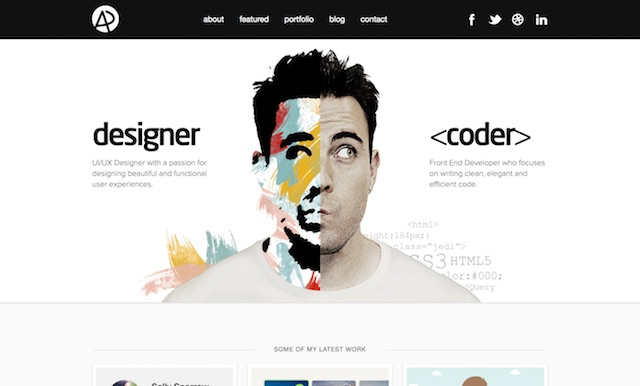
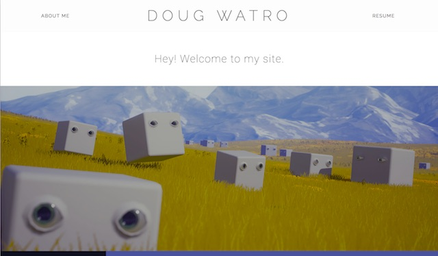

# Project 3 - Web Portfolio
## 1. Overview
One thing that we hear again and again from employers is how essential it is for GDD and NMID students to have a portfolio of "passion projects" (or side projects outside of class) to demonstrate their talent and passion for creating games and interactive experiences. The most common way to let others see these projects is by posting them to the Web in a formal portfolio. 

Each portfolio piece should be showcased with the following:
- a description
- a discussion of the technologies and/or techniques that were used
- detail your exact role (if it was a group project)
- multiple screenshots
- ideally a link to a demo video that is hosted on YouTube or Vimeo
- if possible, a Web-playable version of the project

There are many ways to publish your portfolio of work to the Web:
- https://www.behance.net
- https://www.linkedin.com
- https://github.com and/or https://pages.github.com
- https://wordpress.com or similar
- https://people.rit.edu (the banjo.rit.edu server)

*Don't yet have much to show to employers? Fortunately, Project 2 & Project 3 can potentially get you started on two portolio pieces.*

This semester, you will create and publish a portfolio of your work to people.rit.edu.

## 2. Description
You will create a personal portfolio site to showcase your work to potential employers and/or customers. The site must include examples of your work, contact information, and your resume. The examples should include at least three different things you've created; those could be projects or exercises from this or other classes, or work you've done on your own. An effective portfolio will highlight your *best work*, and that work should correlate to your career goals. 

Here are some example portfolios that were created by IGM students:
- http://katiepustolski.com/
- http://brianemling.com/
- http://dougwatro.com

Some sample portfolio projects from last year:
    - http://barringtoncampbell.com/
    - https://people.rit.edu/mxb9517/portfolio/
    - https://people.rit.edu/ctb4332/portfolio/
    - https://people.rit.edu/mac9406/portfolio/
    - https://people.rit.edu/sxf5282/portfolio/
    - https://people.rit.edu/sml6783/230/portfolio/
    - https://people.rit.edu/lpn4937/portfolio/
    - https://people.rit.edu/djs5435/portfolio/
    - https://people.rit.edu/jds7523/portfolio/
    - https://people.rit.edu/drs4149/portfolio/
    - https://people.rit.edu/ekt6170/portfolio.html
    - https://people.rit.edu/axw1799/portfolio/
    - https://people.rit.edu/wjb5377/230/portfolio/
    - https://people.rit.edu/iae2784/portfolio/
    - https://people.rit.edu/swa4861/portfolio/

Some other examples are here:
- [http://www.adhamdannaway.com (utilized Wordpress Themes)](http://www.adhamdannaway.com)
- https://onepagelove.com

## 3. Content Requirements
-The page is named index.html, and it will include:
  - A navigation system to allow the user to quickly access distinct content
  - Your name and an image (could be a photo or an avatar)
  - A *tagline* (see #2 here: https://www.smashingmagazine.com/2009/02/10-steps-to-the-perfect-portfolio-website/) - example: "Creative Developer," "Unity/Unreal Game Developer seeking an internship opportunity," etc.
  - "About you" content - example: "I'm a UX/UI Designer and Front End Developer from Sydney, Australia. I enjoy turning complex problems into simple, beautiful and intuitive interface designs. When I'm not coding or pushing pixels, you'll find me in the gym or on the court shooting hoops."
  - Contact information and a PHP-based **contact form**
  - A gallery section with brief information about each of your work examples (examples can be projects or exercises from this class or other classes, or work you've done on your own)
  - Individual sub-section sections with more detail for each of your work examples:
    - Each example needs a title, an image (could be a screenshot, photo, or link to a working demo video), and a one-paragraph description that highlights the tools you used and the skills that it illustrates. If the example is interactive and can play in a Web browser, a link to a working version should be provided
    - If the example is from a group project, be sure to clearly indicate what your role was on the project
  - Resume (either printer-friendly HTML, or a PDF; **NEVER** a Word doc) that also has a printer-friendly stylesheet

## 4. Design Requirements
- The site is a [responsive](https://en.wikipedia.org/wiki/Responsive_web_design), [single-page design](https://en.wikipedia.org/wiki/Single-page_application)
- It must have a minimum of two layouts--one optimized for desktop, one for phones
- It is assumed that you wil be using a CSS framework such as Bootstrap. If so, colors and typefaces must be modified so that the site is not a "cookie cutter" replica of the framework's templates
- Principles of visual design (taught in prerequisite classes) employed: clear visual hierarchy, good use of white space, effective alignment of content, thoughtful choices of colors and visual elements
- Effective typography employed; typeface(s) chosen should be clear and legible as well as appropriate to the content being presented
- The initial "landing" on the page should be compelling, ideally with a tag line and page design that "pulls" the user in. 

## 5. Technology Requirements
- Semantic, valid HTML
- Well-structured, valid CSS
- Semantic HTML
- Images and other media are properly optimized (both file size, image format, and image dimensions) for screen display

## 6. Documentation Requirements (submit to dropbox in a PDF file)
- Notes page with information about how you made the site, including the following content: 
- Source information for any images or code that you didn't create yourself (including CSS frameworks, typefaces, and any code libraries)
- If you used a CSS framework, explain how you modified it so that your portfolio doesn't look exactly like other sites that use that framework. 
- What you did to go beyond the base expectations for the project--what did you do that was particularly challenging? This could involve art/design, content, or code. 

## 7. Final Submission and Due Date
The site must be placed in a portfolio directory inside of your igme230 directory (`http://people.rit.edu/youruserid/230/portfolio/`), and you should add a link to your portfolio from your project 1 page.

- See dropbox for due date
- The page should display properly at the URL specified above by that time
- ZIP and Post the project to mycourses, and put a link to the URL in the comments field of the dropbox

## 8. Grading
If you complete all required components with no errors, you'll earn 16/20 points, or 80%. In order to go above that, 

Requirement | Possible Points (20) |
----------- | --------------- |
All required content present | 3 |
Written content quality and organization | 3 |
Responsive Design | 2 |
Visual Design | 2 |
Typography | 1 |
Sematic, valid HTML | 1 |
Well-structured, valid CSS | 1 |
Functional PHP contact form | 1 |
No major accessibility errors | 1|
Drop-down navigation menu | 1 |
Properly optimized media | 1 |
"Above and Beyond" | 3 |

# 9. Portfolio Guidelines
- As you begin putting together your portfolio, keep the following in mind:
  - Design for your audience. Potential employers want a quick and straightforward way to get information about you and see if you are a good fit for the job.
  - Present yourself for the job and company you want.
  - Only post projects you're proud of; don't include everything you've done if it doesn't really showcase your unique skills.
  - Likewise, don't post too many or too few projects. Showcase your work without overwhelming your audience.
  - Review our Portfolio lecture!

# 10. Resources
- [Lynda.com Bootstrap Tutorial](https://www.lynda.com/Bootstrap-tutorials/What-well-build/186538/371577-4.html) - this is a about 2 hours, and walks you through creating a template that you can build on.

## 11. Examples

### A. Student Work
- [Some examples from previous semester's we showed you day 1](../weekly/week-01A-notes.md#vi-projects-and-other-stuff-for-inspiration)

### B. http://www.adhamdannaway.com

### C. Here is the mobile version of the same page

### D. http://dougwatro.com

### E. Lynda.com Bootstrap example

